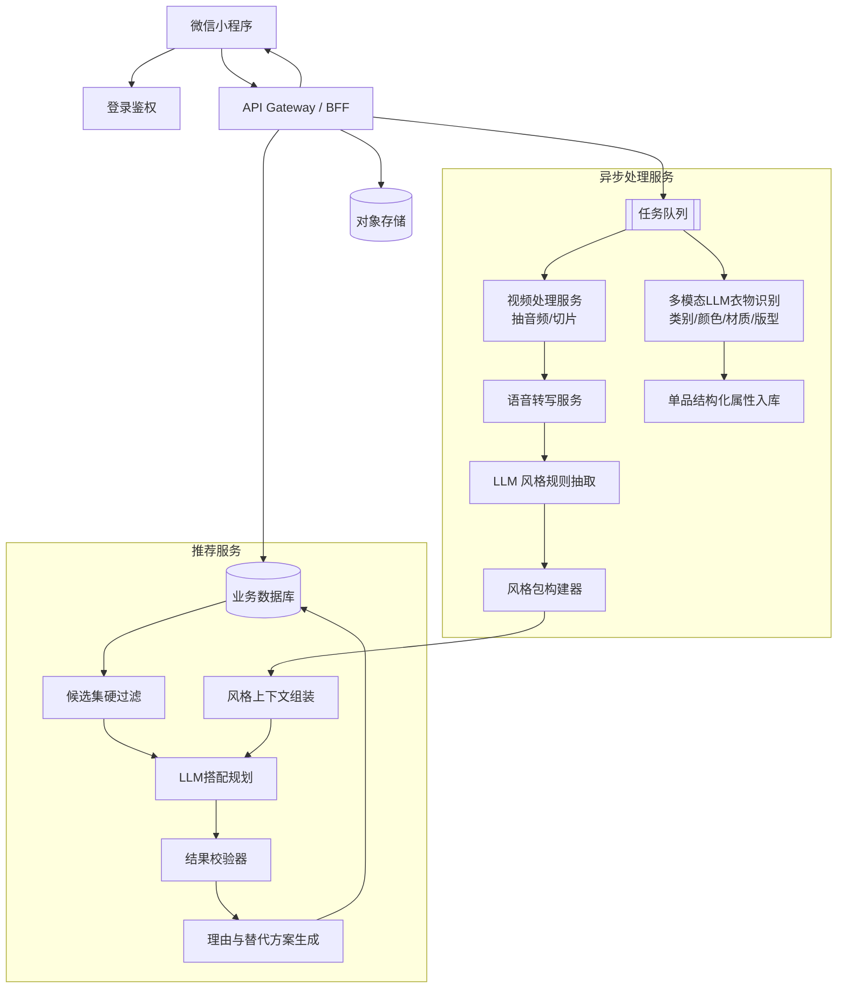
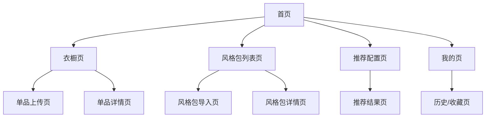

# 衣橱穿搭助手小程序 PRD（MVP）

## 1. 产品背景与目标

### 1.1 产品背景
用户日常有大量已购衣物，但普遍存在以下问题：
- 衣服很多，但不知道如何搭配
- 单品拍照后难以形成统一的数字衣橱
- 喜欢某位穿搭博主的搭配思路，但难以沉淀为可复用的方法
- 看过视频后有灵感，但很难结合自己的真实衣橱落地

本产品定位为一款微信小程序：帮助用户把“已有衣橱”数字化，并结合用户手动导入的、已获授权的穿搭内容，生成适合自己的穿搭推荐。

### 1.2 产品目标
MVP 阶段目标：
1. 帮助用户快速建立个人数字衣橱
2. 从已授权的视频或文本中提取可复用的“穿搭思路”
3. 基于“用户衣橱 + 风格包”推荐可执行穿搭
4. 形成可扩展的风格包机制，支持后续新增更多博主/风格来源

### 1.3 成功标准（MVP）
- 用户可在 10 分钟内完成首批衣橱建档
- 单品识别结果支持人工校正，完成率达到 90%+
- 用户可成功导入 1 个风格包（视频或文本）
- 推荐结果能生成 2~6 套可执行穿搭
- 推荐结果可解释，能说明每套搭配的推荐理由

---

## 2. 目标用户与核心价值

### 2.1 目标用户
1. **轻度穿搭需求用户**
   - 有基础衣橱
   - 希望减少“每天不知道穿什么”的决策成本

2. **内容驱动型用户**
   - 有喜欢的穿搭博主
   - 希望把博主的穿搭逻辑迁移到自己的衣橱

3. **衣橱管理型用户**
   - 愿意整理衣物
   - 希望对已有衣服做数字化管理和复用

### 2.2 核心用户价值
- 让“衣服照片”变成可搜索、可搭配的数字单品
- 让“穿搭视频/文案”变成结构化风格规则
- 让“喜欢的风格”真正落地到“我现有的衣服”

---

## 3. MVP 范围

### 3.1 In Scope（MVP 必做）
1. 衣橱建档
   - 拍照/上传单品图片
   - 自动提取基础特征：类别、颜色、图案、季节、风格标签
   - 手动修改识别结果

2. 单品特征识别与确认
   - 上传原始衣物图片
   - 调用多模态大模型 API 提取单品特征
   - 用户手动确认与修改识别结果

3. 风格包导入
   - 支持用户手动导入**已授权**文本内容
   - 支持用户手动导入**已授权**视频内容
   - 视频支持抽取音频并进行 ASR 转写
   - 从文本中抽取结构化风格规则，并允许用户编辑确认

4. 穿搭推荐
   - 基于天气/场景/偏好生成 2~6 套 Look
   - 每套 Look 展示推荐理由
   - 提供可替换备选单品

5. 反馈闭环
   - 用户可对推荐结果反馈喜欢/不喜欢/不合适原因

### 3.2 Out of Scope（MVP 不做）
- 不直接抓取小红书或其他平台内容
- 不接入未授权的博主内容
- 不做虚拟试穿、换脸、换身
- 不做高质量全身写真级“整套穿搭图像生成”
- 不做自动电商购买链路

### 3.3 关键边界
本产品 **不直接抓取小红书视频/图文**，仅支持用户**手动导入已获授权的视频或文本**作为风格学习输入。

---

## 4. 核心用户流程

### 4.1 首次使用流程
1. 用户进入小程序
2. 完成登录与基础资料设置
3. 上传/拍摄已有衣服照片
4. 系统识别单品特征并生成待确认结果
5. 用户人工修正识别结果
6. 用户上传已授权视频/文本，创建风格包
7. 系统抽取风格规则，用户确认
8. 用户选择场景并获取穿搭推荐

### 4.2 日常推荐流程
1. 用户选择今日场景（如通勤/约会/日常）
2. 选择天气、温度、风格倾向
3. 系统根据衣橱和风格包生成搭配
4. 用户查看理由、调整、收藏或反馈

### 4.3 风格包扩展流程
1. 用户新增一个风格来源
2. 选择上传文本或视频
3. 系统解析并抽取规则
4. 用户编辑命名（如“通勤极简风”“日系松弛感”）
5. 风格包进入可选推荐体系

---

## 5. 功能需求拆分

### 5.1 模块 A：用户与衣橱管理

#### 5.1.1 用户能力
- 微信登录
- 用户基础偏好设置：常穿风格、尺码、所在城市、体感偏好
- 用户偏好更新

#### 5.1.2 衣橱管理能力
- 上传单品图片
- 单品分类：上衣、下装、外套、连衣裙、鞋、包、配饰
- 查看单品详情
- 编辑单品特征
- 删除/归档单品

#### 5.1.3 单品特征字段
- 类别
- 主色/辅色
- 图案
- 版型（宽松/修身/短款/长款）
- 季节（春/夏/秋/冬）
- 材质/厚薄（粗粒度）
- 风格标签（通勤/休闲/基础/甜酷等）

### 5.2 模块 B：单品特征识别与确认

#### 5.2.1 MVP 主方案
MVP 阶段不依赖传统 OCR，也不要求抠图/去背景，直接使用多模态大模型 API 对用户上传的衣物图片做结构化特征识别。

标准流程：
1. 用户上传原始衣物图片
2. 对象存储落盘
3. 调用多模态大模型 API 提取衣物特征
4. 返回结构化 JSON 结果与字段置信度
5. 前端展示“待确认单品卡”
6. 用户修改/确认后写入衣橱

#### 5.2.2 建议提取字段
- 一级类别：上衣、下装、外套、裙装、鞋、包、配饰
- 二级类别：T恤、衬衫、针织衫、直筒裤、百褶裙等
- 主色/辅色
- 图案
- 材质
- 版型
- 长度
- 适用季节
- 风格标签
- 场景标签
- 字段级置信度

#### 5.2.3 产品约束
- 不要求图片先做抠图后再识别
- 不依赖传统 OCR 识别衣服文本信息
- 用户需尽量上传“单张图只包含一件主衣物”的照片
- 所有识别结果必须支持人工修改，确认后才参与推荐

#### 5.2.4 不建议的 MVP 方案
- 端到端生成新的衣服图像
- 基于复杂多人场景照片自动拆解全部单品
- 在未确认前直接将模型识别结果用于推荐

### 5.3 模块 C：风格包导入与管理

#### 5.3.1 输入方式
1. 文本导入
   - 用户粘贴文字版穿搭心得/笔记/整理稿
2. 视频导入
   - 用户上传已授权视频文件
   - 系统抽音频并转写为文本

#### 5.3.2 风格规则抽取
系统从文本中抽取如下结构化信息：
- 风格主题
- 常见单品组合
- 配色原则
- 版型原则
- 场景适配
- 季节适配
- 避雷建议
- 搭配优先级

#### 5.3.3 用户确认机制
抽取结果默认不可直接生效，需用户确认：
- 编辑标签
- 删除无效规则
- 修正规则表述
- 给风格包命名与备注

### 5.4 模块 D：穿搭推荐

#### 5.4.1 输入条件
- 场景：通勤/约会/休闲/旅行等
- 天气/温度
- 用户偏好（想显瘦、想松弛、想正式等）
- 选定风格包

#### 5.4.2 输出内容
- 推荐 2~6 套 Look
- 每套包含：
  - 单品组合
  - 推荐理由
  - 替换建议
  - 场景说明

#### 5.4.3 推荐理由示例
- “采用上短下长比例，符合该风格包强调的显高原则”
- “颜色以低饱和中性色为主，符合通勤极简规则”
- “在当前温度下加入轻薄外套，兼顾层次和实穿性”

### 5.5 模块 E：反馈学习
- 喜欢/不喜欢
- 原因反馈：太热、太冷、不适合身材、不喜欢颜色、不够正式
- 收藏搭配
- 反馈用于后续排序微调

---

## 6. 风格包机制设计

### 6.1 核心定义
风格包（Style Pack）是系统对某一风格来源的结构化沉淀，包含：
- 来源信息
- 风格摘要
- 结构化规则 JSON
- 推荐提示词上下文
- 版本号

### 6.2 设计原则
1. **来源合规**：仅接收用户手动导入的已授权内容
2. **可编辑**：系统抽取后必须允许用户校正
3. **可版本化**：同一风格包可迭代更新
4. **可插拔**：后续新增博主时可直接新增风格包，不破坏现有架构

### 6.3 风格包结构示意
```json
{
  "name": "通勤极简风",
  "sourceType": "video",
  "summary": "低饱和、中性色、利落、适合通勤场景",
  "rules": {
    "preferred_colors": ["黑", "白", "灰", "卡其"],
    "preferred_fit": ["上短下长", "直线条"],
    "avoid": ["高饱和撞色", "过多复杂图案"],
    "scenes": ["通勤", "会议", "日常"],
    "seasons": ["春", "秋"]
  },
  "prompt_profile": {
    "tone": "克制、利落、极简",
    "bias": ["通勤优先", "显高", "实穿"]
  }
}
```

---

## 7. 技术架构设计

### 7.1 总体设计原则
- 小程序端轻量化，重计算全部后端异步处理
- 单品识别、视频转写、风格抽取、推荐规划主要依赖大模型 API
- 风格包采用“结构化规则 + 推荐提示词上下文”双轨设计
- 所有结果支持人工修正，避免全自动误判带来体验损失
- 推荐系统采用“候选集硬约束 + LLM 规划 + 校验器”混合架构

### 7.2 系统分层
1. **前端层（微信小程序）**
   - 登录
   - 拍照/上传
   - 衣橱浏览与编辑
   - 风格包管理
   - 推荐结果展示与反馈

2. **API 层**
   - 用户接口
   - 单品接口
   - 风格包接口
   - 推荐接口

3. **异步任务层**
   - 图片上传与识别任务
   - 视频处理
   - ASR 转写
   - LLM 风格抽取
   - 推荐生成任务

4. **推荐服务层**
   - 候选集过滤
   - LLM 搭配规划
   - 结果校验器
   - 可解释理由生成

5. **存储层**
   - 关系型数据库
   - 对象存储
   - 模型结果缓存与任务状态存储

### 7.3 Mermaid 架构图


### 7.4 异步处理流水线
#### 7.4.1 衣物图片处理流水线
1. 上传原图
2. 对象存储落盘
3. 入队衣物识别任务
4. 调用多模态大模型 API 识别属性
5. 写回结构化特征与字段置信度
6. 前端展示“待确认单品卡”
7. 用户修改后确认入库

#### 7.4.2 风格包视频处理流水线
1. 上传已授权视频
2. 视频文件存储
3. 抽取音频
4. ASR 转写
5. 文本清洗
6. LLM 规则抽取
7. 用户确认
8. 生成风格包结构化结果与推荐提示词上下文

---

## 8. 推荐引擎设计（MVP）

### 8.1 推荐逻辑
MVP 推荐采用“候选集硬过滤 + LLM 搭配规划 + 结果校验 + 理由生成”的混合方案。

1. **候选集硬过滤**
   - 后端根据场景、天气、温度、季节、用户偏好，从衣橱中筛出可用单品
   - 这一层只负责确定“哪些 item_id 可以被使用”，不负责搭配审美判断

2. **LLM 搭配规划**
   - 将候选单品列表、用户需求、风格包摘要和规则输入大模型
   - 要求模型仅在提供的 item_id 范围内输出 2~6 套搭配

3. **结果校验器**
   - 检查推荐结果中的 item_id 是否真实存在
   - 检查是否缺失必要品类（如上衣/下装/鞋）
   - 检查是否与天气、场景、季节约束冲突

4. **理由与替代方案生成**
   - 对通过校验的推荐结果生成解释文本
   - 输出可替换单品建议，便于用户手动调整

### 8.2 推荐输入设计
```json
{
  "scene": "通勤",
  "temperature": 18,
  "user_profile": {
    "style_preference": ["极简", "通勤"]
  },
  "style_pack": {
    "name": "通勤极简风",
    "summary": "低饱和、中性色、利落、显高",
    "rules": {
      "preferred_colors": ["黑", "白", "灰"],
      "avoid": ["高饱和撞色"]
    }
  },
  "wardrobe_candidates": [
    {"item_id":"i1","category":"上衣","sub_category":"白衬衫","style_tags":["通勤","极简"]},
    {"item_id":"i2","category":"下装","sub_category":"黑西裤","style_tags":["通勤"]},
    {"item_id":"i3","category":"鞋","sub_category":"黑乐福鞋","style_tags":["通勤"]}
  ]
}
```

### 8.3 推荐输出设计
```json
{
  "recommendation_id": "rec_001",
  "outfits": [
    {
      "items": ["i1", "i2", "i3"],
      "reason": "白衬衫与黑西裤符合通勤极简风格，黑色乐福鞋增强整体利落感。",
      "alternatives": [
        {
          "replace_item_id": "i2",
          "with_item_id": "i8",
          "reason": "如果希望更日常，可以替换为浅卡其直筒裤。"
        }
      ]
    }
  ]
}
```

### 8.4 风险控制
- 不允许模型推荐候选集之外的衣物
- 所有推荐结果必须经过服务端校验
- 推荐失败时返回“缺少必要单品/当前约束过严”等明确提示
- 推荐理由由模型生成，但最终展示依赖校验通过的结果

---

## 9. 数据模型建议

### 9.1 ClothingItem
| 字段 | 类型 | 说明 |
|---|---|---|
| id | string | 单品ID |
| userId | string | 用户ID |
| category | string | 类别 |
| subCategory | string | 二级类别 |
| colors | string[] | 颜色 |
| pattern | string | 图案 |
| material | string | 材质 |
| fit | string[] | 版型 |
| length | string | 长度 |
| seasons | string[] | 季节 |
| tags | string[] | 风格标签 |
| occasionTags | string[] | 场景标签 |
| imageOriginalUrl | string | 原图 |
| llmConfidence | json | 字段级置信度 |
| source | string | 上传来源 |
| status | string | pending_review/active/archived |

### 9.2 StylePack
| 字段 | 类型 | 说明 |
|---|---|---|
| id | string | 风格包ID |
| userId | string | 用户ID |
| name | string | 风格包名称 |
| sourceType | string | text/video |
| sourceFileUrl | string | 原始文件地址 |
| transcriptText | text | 视频转写文本 |
| summaryText | text | 风格摘要 |
| rulesJson | json | 结构化规则 |
| promptProfile | json | 推荐提示词上下文 |
| version | int | 版本号 |
| status | string | draft/confirmed |

### 9.3 OutfitRecommendation
| 字段 | 类型 | 说明 |
|---|---|---|
| id | string | 推荐ID |
| userId | string | 用户ID |
| stylePackId | string | 使用的风格包 |
| scene | string | 场景 |
| weather | string | 天气条件 |
| itemIds | string[] | 组合单品 |
| alternatives | json | 替换建议 |
| validatorResult | json | 规则校验结果 |
| reasonText | text | 推荐理由 |
| createdAt | datetime | 创建时间 |

### 9.4 Feedback
| 字段 | 类型 | 说明 |
|---|---|---|
| id | string | 反馈ID |
| outfitId | string | 推荐ID |
| userId | string | 用户ID |
| action | string | like/dislike/save |
| reasonTags | string[] | 反馈原因 |
| comment | string | 补充描述 |

---

## 10. 非功能需求

### 10.1 性能
- 单张衣物图片经多模态大模型识别后，应在 10~30 秒内返回待确认结果
- 视频转写按时长异步处理，前端可查看处理中状态
- 推荐结果在 3 秒内返回首屏结果

### 10.2 可用性
- 核心识别结果必须可编辑
- 上传流程要可中断恢复
- 推荐失败时给出明确原因（如衣橱单品不足）

### 10.3 合规与安全
- 明确提示仅上传已授权内容
- 文本、图片、视频需经过内容安全审核
- 存储用户上传内容时提供删除能力

### 10.4 可扩展性
- 风格包机制支持新增更多来源
- 推荐引擎可逐步从单轮 LLM 规划升级为多轮规划与个性化反馈优化

---

## 11. 里程碑与阶段规划

### 阶段 1：MVP（4~6 周）
- 微信小程序基础框架
- 登录与用户信息
- 衣橱上传与编辑
- 单品多模态识别与人工确认
- 文本/视频风格包导入
- 视频 ASR 转写
- 基于规则的穿搭推荐

### 阶段 2：增强版（3~5 周）
- 推荐理由优化
- 天气联动
- 收藏与历史推荐
- 反馈驱动的排序优化
- 风格包版本管理优化

### 阶段 3：扩展版（后续）
- 更多风格包模板
- 多人共享风格包
- 更细粒度标签体系
- 组合图视觉优化

---

## 12. 风险与开放问题

### 12.1 风险
1. **识别误差风险**
   - 颜色、版型、图案识别可能不准
   - 应对：提供人工修正机制

2. **内容合规风险**
   - 用户上传内容的授权真实性难完全校验
   - 应对：前置授权声明、记录导入来源

3. **推荐稀疏风险**
   - 用户衣橱少时，推荐结果有限
   - 应对：提示补充基础单品或提供缺失建议

4. **视频转写质量风险**
   - 噪音、口语化表达影响规则抽取质量
   - 应对：加入文本清洗和用户确认流程

### 12.2 开放问题
1. 首发场景是通勤优先、日常优先还是多场景并行？
2. MVP 是否需要接入天气 API？
3. 风格包是仅个人私有，还是支持用户分享？
4. 推荐结果的视觉呈现采用卡片拼贴还是 look board？
5. 风格规则编辑器是自由编辑还是标签化表单优先？

---

## 13. MVP 结论

本项目的 MVP 应聚焦于三个核心闭环：
1. **真实衣橱数字化**：把现有衣服变成可识别、可管理的单品资产
2. **风格知识结构化**：把已授权的穿搭视频/文本转化为可复用规则
3. **可执行推荐**：结合衣橱和风格包，生成可解释、可反馈、可持续优化的穿搭建议

在此基础上，后续再逐步增加更多风格包、更多推荐维度和更好的视觉呈现，而不是在 MVP 阶段追求高风险的全生成式效果。

---

## 14. 页面清单与信息架构

### 14.1 页面清单
| 页面 | 路径建议 | 主要目标 | 主要入口 |
|---|---|---|---|
| 首页 | `/pages/home/index` | 承接今日推荐、快捷操作、任务状态提醒 | 启动页、Tab |
| 衣橱页 | `/pages/closet/index` | 浏览与筛选全部单品 | Tab |
| 单品上传页 | `/pages/closet/upload` | 拍照/上传单品图片并提交识别 | 首页、衣橱页 |
| 单品详情页 | `/pages/closet/detail` | 查看识别结果、编辑标签、删除/归档 | 衣橱页 |
| 风格包列表页 | `/pages/style-pack/index` | 查看、切换、管理风格包 | 首页、我的 |
| 风格包导入页 | `/pages/style-pack/import` | 导入已授权文本或视频 | 风格包列表页 |
| 风格包详情页 | `/pages/style-pack/detail` | 查看来源、规则、状态并确认生效 | 风格包列表页 |
| 推荐配置页 | `/pages/recommend/config` | 选择场景、天气、风格倾向 | 首页 |
| 推荐结果页 | `/pages/recommend/result` | 展示 Look、理由、备选与反馈 | 推荐配置页 |
| 历史/收藏页 | `/pages/history/index` | 查看历史推荐与收藏结果 | 我的 |
| 我的页 | `/pages/profile/index` | 个人偏好、授权说明、系统设置 | Tab |

### 14.2 信息架构建议


---

## 15. 页面级功能说明

### 15.1 首页
**页面目标**：承接用户高频入口，快速进入“上传衣服”“导入风格包”“开始推荐”。

**核心模块**：
- 今日推荐入口
- 处理中任务提醒（图片识别中、视频转写中、风格包待确认）
- 快捷操作入口
- 最近使用风格包

**关键状态**：
- 新用户空态：引导先上传单品
- 衣橱未完成空态：提示先补齐基础单品
- 有待确认风格包：展示确认入口

### 15.2 衣橱页
**页面目标**：统一管理单品。

**核心功能**：
- 分类筛选、颜色筛选、季节筛选、风格标签筛选
- 查看单品识别结果与属性状态
- 进入单品详情
- 发起新增上传

### 15.3 单品详情页
**页面目标**：承接识别结果确认与修正。

**核心功能**：
- 展示原图与多模态识别结果
- 编辑类别、颜色、材质、版型、季节、标签
- 删除/归档
- 标记“暂不推荐”

### 15.4 风格包导入页
**页面目标**：引导用户完成已授权文本/视频导入。

**核心功能**：
- 选择导入类型（文本/视频）
- 展示授权提醒与勾选确认
- 上传文件或粘贴文本
- 查看处理进度

### 15.5 风格包详情页
**页面目标**：确认规则抽取结果并使风格包生效。

**核心功能**：
- 查看来源信息与导入时间
- 查看转写文本摘要
- 查看规则 JSON 的可视化结果
- 编辑规则标签、删除错误规则
- 确认生效/停用/重命名

### 15.6 推荐结果页
**页面目标**：展示推荐 Look 并承接反馈闭环。

**核心功能**：
- 展示 2~6 套搭配
- 展示每套推荐理由
- 展示可替换备选单品
- 操作：喜欢、不喜欢、收藏、重新生成

### 15.7 我的页
**页面目标**：承接偏好与系统设置。

**核心功能**：
- 管理个人偏好
- 查看已上传内容与授权说明
- 查看历史推荐/收藏
- 查看隐私与内容删除说明

---

## 16. 任务状态流转与权限/异常态

### 16.1 核心任务状态流转
| 对象 | 状态 | 说明 | 前端提示 |
|---|---|---|---|
| 单品上传任务 | uploaded | 文件已上传，等待处理 | 已上传，待识别 |
| 单品上传任务 | processing | 正在调用多模态模型识别 | 识别中，请稍候 |
| 单品上传任务 | needs_review | 识别完成，待用户确认 | 请确认单品信息 |
| 单品上传任务 | completed | 已确认，可用于推荐 | 已加入衣橱 |
| 单品上传任务 | failed | 识别失败 | 请重试上传 |
| 风格包任务 | uploaded | 视频/文本已提交 | 已提交，待处理 |
| 风格包任务 | transcribing | 视频正在抽音频/转写 | 转写中 |
| 风格包任务 | extracting | 正在抽取规则 | 正在生成风格规则 |
| 风格包任务 | needs_confirm | 规则待用户确认 | 请确认风格包内容 |
| 风格包任务 | active | 已确认生效 | 已可用于推荐 |
| 风格包任务 | failed | 转写或抽取失败 | 导入失败，请重试 |

### 16.2 权限说明
- 首次使用需获取微信登录态
- 上传图片/视频前需申请相册/相机权限
- 若用户拒绝权限，应提供“去设置开启权限”的引导
- 视频/文本导入时需用户勾选“我已获得授权”声明

### 16.3 异常态说明
1. **上传失败**：网络异常、文件过大、格式不支持
2. **识别失败**：图片模糊、衣物主体不完整、背景干扰过大
3. **视频转写失败**：音频质量差、视频损坏、时长超限
4. **规则抽取失败**：文本内容过短、信息不足、语义噪音过大
5. **无可推荐单品**：用户衣橱单品不足或过滤条件过严
6. **推荐结果稀缺**：提示补充基础单品或放宽筛选条件

---

## 17. API 草案

### 17.1 设计原则
- 小程序仅访问业务 API，不直接访问底层 AI 服务
- 长耗时任务统一异步化，返回 taskId 供前端轮询或订阅
- 返回体统一包含 `code`、`message`、`data`、`requestId`

### 17.2 用户与偏好
| 方法 | 路径 | 目的 | 关键入参 | 关键出参 |
|---|---|---|---|---|
| POST | `/api/auth/wechat-login` | 微信登录换取会话 | code | token, userInfo |
| GET | `/api/users/profile` | 获取个人资料 | - | userProfile |
| PUT | `/api/users/profile` | 更新偏好设置 | stylePrefs, city, bodyPrefs | success |

### 17.3 衣橱相关接口
| 方法 | 路径 | 目的 | 关键入参 | 关键出参 |
|---|---|---|---|---|
| POST | `/api/closet/items/upload` | 上传单品图片并创建识别任务 | file, sourceType | itemId, taskId |
| GET | `/api/closet/items` | 获取单品列表 | category, season, tags, pageNo | list, total |
| GET | `/api/closet/items/{itemId}` | 获取单品详情 | itemId | itemDetail |
| PUT | `/api/closet/items/{itemId}` | 更新单品属性 | category, subCategory, colors, material, fit, tags, seasons | success |
| POST | `/api/closet/items/{itemId}/confirm` | 确认识别结果并入衣橱 | itemId | success |
| POST | `/api/closet/items/{itemId}/archive` | 归档单品 | itemId | success |
| DELETE | `/api/closet/items/{itemId}` | 删除单品 | itemId | success |

### 17.4 风格包相关接口
| 方法 | 路径 | 目的 | 关键入参 | 关键出参 |
|---|---|---|---|---|
| POST | `/api/style-packs/import/text` | 导入文本风格包 | text, title, authConfirmed | stylePackId, taskId |
| POST | `/api/style-packs/import/video` | 导入视频风格包 | file, title, authConfirmed | stylePackId, taskId |
| GET | `/api/style-packs` | 获取风格包列表 | status, pageNo | list, total |
| GET | `/api/style-packs/{stylePackId}` | 获取风格包详情 | stylePackId | detail |
| PUT | `/api/style-packs/{stylePackId}` | 更新风格包规则 | name, rulesJson, summaryText | success |
| POST | `/api/style-packs/{stylePackId}/activate` | 激活风格包 | stylePackId | success |
| POST | `/api/style-packs/{stylePackId}/deactivate` | 停用风格包 | stylePackId | success |

### 17.5 推荐相关接口
| 方法 | 路径 | 目的 | 关键入参 | 关键出参 |
|---|---|---|---|---|
| POST | `/api/recommendations/generate` | 生成穿搭推荐 | scene, weather, stylePackId, preferenceTags | recommendationId, outfits |
| GET | `/api/recommendations/{recommendationId}` | 获取推荐详情 | recommendationId | looks, reasons |
| POST | `/api/recommendations/{recommendationId}/feedback` | 提交反馈 | action, reasonTags, comment | success |
| POST | `/api/recommendations/{recommendationId}/save` | 收藏搭配 | recommendationId | success |

### 17.6 任务状态接口
| 方法 | 路径 | 目的 | 关键入参 | 关键出参 |
|---|---|---|---|---|
| GET | `/api/tasks/{taskId}` | 获取异步任务状态 | taskId | status, progress, resultSummary |

### 17.7 返回体示例
```json
{
  "code": 0,
  "message": "ok",
  "data": {
    "taskId": "task_123",
    "status": "processing"
  },
  "requestId": "req_abc"
}
```

---

## 18. 埋点方案与指标设计

### 18.1 核心漏斗
1. 访问首页
2. 完成首次登录
3. 上传首件单品
4. 完成首件单品确认
5. 导入首个风格包
6. 完成首个风格包确认
7. 生成首个推荐结果
8. 产生首次反馈/收藏

### 18.2 关键事件表
| 事件名 | 触发时机 | 关键属性 |
|---|---|---|
| `home_view` | 首页曝光 | userId, isNewUser |
| `closet_upload_click` | 点击上传单品 | sourcePage |
| `closet_upload_success` | 单品上传成功 | itemId, sourceType |
| `closet_review_submit` | 提交单品确认 | itemId, category, editedFields |
| `style_pack_import_start` | 开始导入风格包 | sourceType, contentLength |
| `style_pack_import_success` | 风格包导入成功 | stylePackId, sourceType |
| `style_pack_confirm_submit` | 确认风格包规则 | stylePackId, editedRuleCount |
| `recommend_generate_click` | 点击生成推荐 | scene, weather, stylePackId |
| `recommend_result_view` | 推荐结果曝光 | recommendationId, lookCount |
| `recommend_feedback_submit` | 提交反馈 | recommendationId, action, reasonTags |
| `recommend_save_click` | 收藏推荐 | recommendationId, lookId |

### 18.3 核心指标
- 激活率：访问首页用户中完成首件单品上传的占比
- 衣橱建档完成率：上传后完成确认的单品占比
- 风格包导入完成率：发起导入后进入 active 状态的占比
- 推荐触发率：完成衣橱+风格包后发起推荐的占比
- 推荐互动率：推荐曝光后产生喜欢/不喜欢/收藏行为的占比
- 收藏率：推荐结果中被收藏的 Look 占比

### 18.4 分析重点
- 新用户是否卡在“首件单品确认”
- 用户是否卡在“风格包待确认”
- 哪类场景下推荐点击率更高
- 哪类反馈原因最常见，用于后续优化排序逻辑

---

## 19. 补充实现约束

### 19.1 前后端协作约束
- 页面中的“处理中”状态必须与任务状态接口一致
- 所有编辑操作优先本地表单校验，再提交服务端
- 推荐页必须展示至少一条可解释理由

### 19.2 数据与埋点协作约束
- 事件命名统一采用英文 snake_case 或 lowerCamelCase，不与接口字段混用
- recommendationId、stylePackId、itemId 为埋点必传主键
- 对失败事件也需要埋点，以便识别漏斗断点

### 19.3 合规提示文案要求
- 在风格包导入页必须展示“仅上传已获得授权的内容”提示
- 在视频上传前展示支持格式、大小、时长限制
- 在内容删除入口明确说明删除后对推荐历史的影响
