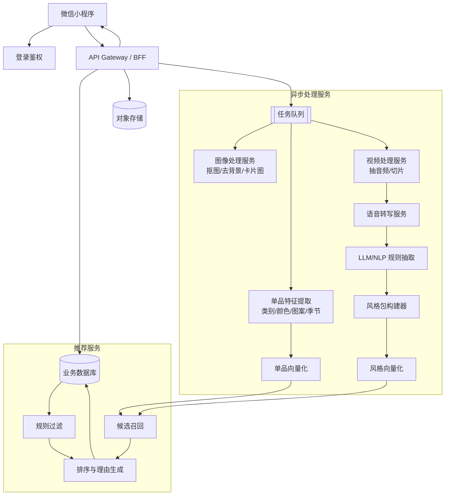

# 衣橱穿搭助手小程序 PRD（MVP）

## 1. 产品背景与目标

### 1.1 产品背景
用户日常有大量已购衣物，但普遍存在以下问题：
- 衣服很多，但不知道如何搭配
- 单品拍照后难以形成统一的数字衣橱
- 喜欢某位穿搭博主的搭配思路，但难以沉淀为可复用的方法
- 看过视频后有灵感，但很难结合自己的真实衣橱落地

本产品定位为一款微信小程序：帮助用户把“已有衣橱”数字化，并结合用户手动导入的、已获授权的穿搭内容，生成适合自己的穿搭推荐。

### 1.2 产品目标
MVP 阶段目标：
1. 帮助用户快速建立个人数字衣橱
2. 从已授权的视频或文本中提取可复用的“穿搭思路”
3. 基于“用户衣橱 + 风格包”推荐可执行穿搭
4. 形成可扩展的风格包机制，支持后续新增更多博主/风格来源

### 1.3 成功标准（MVP）
- 用户可在 10 分钟内完成首批衣橱建档
- 单品识别结果支持人工校正，完成率达到 90%+
- 用户可成功导入 1 个风格包（视频或文本）
- 推荐结果能生成 2~6 套可执行穿搭
- 推荐结果可解释，能说明每套搭配的推荐理由

---

## 2. 目标用户与核心价值

### 2.1 目标用户
1. **轻度穿搭需求用户**
   - 有基础衣橱
   - 希望减少“每天不知道穿什么”的决策成本

2. **内容驱动型用户**
   - 有喜欢的穿搭博主
   - 希望把博主的穿搭逻辑迁移到自己的衣橱

3. **衣橱管理型用户**
   - 愿意整理衣物
   - 希望对已有衣服做数字化管理和复用

### 2.2 核心用户价值
- 让“衣服照片”变成可搜索、可搭配的数字单品
- 让“穿搭视频/文案”变成结构化风格规则
- 让“喜欢的风格”真正落地到“我现有的衣服”

---

## 3. MVP 范围

### 3.1 In Scope（MVP 必做）
1. 衣橱建档
   - 拍照/上传单品图片
   - 自动提取基础特征：类别、颜色、图案、季节、风格标签
   - 手动修改识别结果

2. 单品图片标准化
   - 抠图/去背景
   - 生成统一展示的单品卡片图（白底图、透明底图）

3. 风格包导入
   - 支持用户手动导入**已授权**文本内容
   - 支持用户手动导入**已授权**视频内容
   - 视频支持抽取音频并进行 ASR 转写
   - 从文本中抽取结构化风格规则，并允许用户编辑确认

4. 穿搭推荐
   - 基于天气/场景/偏好生成 2~6 套 Look
   - 每套 Look 展示推荐理由
   - 提供可替换备选单品

5. 反馈闭环
   - 用户可对推荐结果反馈喜欢/不喜欢/不合适原因

### 3.2 Out of Scope（MVP 不做）
- 不直接抓取小红书或其他平台内容
- 不接入未授权的博主内容
- 不做虚拟试穿、换脸、换身
- 不做高质量全身写真级“整套穿搭图像生成”
- 不做自动电商购买链路

### 3.3 关键边界
本产品 **不直接抓取小红书视频/图文**，仅支持用户**手动导入已获授权的视频或文本**作为风格学习输入。

---

## 4. 核心用户流程

### 4.1 首次使用流程
1. 用户进入小程序
2. 完成登录与基础资料设置
3. 上传/拍摄已有衣服照片
4. 系统识别单品特征并生成单品卡片
5. 用户人工修正识别结果
6. 用户上传已授权视频/文本，创建风格包
7. 系统抽取风格规则，用户确认
8. 用户选择场景并获取穿搭推荐

### 4.2 日常推荐流程
1. 用户选择今日场景（如通勤/约会/日常）
2. 选择天气、温度、风格倾向
3. 系统根据衣橱和风格包生成搭配
4. 用户查看理由、调整、收藏或反馈

### 4.3 风格包扩展流程
1. 用户新增一个风格来源
2. 选择上传文本或视频
3. 系统解析并抽取规则
4. 用户编辑命名（如“通勤极简风”“日系松弛感”）
5. 风格包进入可选推荐体系

---

## 5. 功能需求拆分

### 5.1 模块 A：用户与衣橱管理

#### 5.1.1 用户能力
- 微信登录
- 用户基础偏好设置：常穿风格、尺码、所在城市、体感偏好
- 用户偏好更新

#### 5.1.2 衣橱管理能力
- 上传单品图片
- 单品分类：上衣、下装、外套、连衣裙、鞋、包、配饰
- 查看单品详情
- 编辑单品特征
- 删除/归档单品

#### 5.1.3 单品特征字段
- 类别
- 主色/辅色
- 图案
- 版型（宽松/修身/短款/长款）
- 季节（春/夏/秋/冬）
- 材质/厚薄（粗粒度）
- 风格标签（通勤/休闲/基础/甜酷等）

### 5.2 模块 B：单品图像标准化

#### 5.2.1 MVP 推荐方案
MVP 阶段“生成衣服图片”优先采用以下可控方案：
1. 衣物主体检测
2. 抠图/去背景
3. 阴影修正、边缘补齐
4. 生成统一白底图/透明底 PNG/卡片图

#### 5.2.2 不建议的 MVP 方案
- 凭一张照片完整生成新衣服图
- 直接生成高一致性的模特上身图

原因：
- 生成质量不稳定
- 与真实单品一致性难保证
- 工程成本和审核风险高

### 5.3 模块 C：风格包导入与管理

#### 5.3.1 输入方式
1. 文本导入
   - 用户粘贴文字版穿搭心得/笔记/整理稿
2. 视频导入
   - 用户上传已授权视频文件
   - 系统抽音频并转写为文本

#### 5.3.2 风格规则抽取
系统从文本中抽取如下结构化信息：
- 风格主题
- 常见单品组合
- 配色原则
- 版型原则
- 场景适配
- 季节适配
- 避雷建议
- 搭配优先级

#### 5.3.3 用户确认机制
抽取结果默认不可直接生效，需用户确认：
- 编辑标签
- 删除无效规则
- 修正规则表述
- 给风格包命名与备注

### 5.4 模块 D：穿搭推荐

#### 5.4.1 输入条件
- 场景：通勤/约会/休闲/旅行等
- 天气/温度
- 用户偏好（想显瘦、想松弛、想正式等）
- 选定风格包

#### 5.4.2 输出内容
- 推荐 2~6 套 Look
- 每套包含：
  - 单品组合
  - 推荐理由
  - 替换建议
  - 场景说明

#### 5.4.3 推荐理由示例
- “采用上短下长比例，符合该风格包强调的显高原则”
- “颜色以低饱和中性色为主，符合通勤极简规则”
- “在当前温度下加入轻薄外套，兼顾层次和实穿性”

### 5.5 模块 E：反馈学习
- 喜欢/不喜欢
- 原因反馈：太热、太冷、不适合身材、不喜欢颜色、不够正式
- 收藏搭配
- 反馈用于后续排序微调

---

## 6. 风格包机制设计

### 6.1 核心定义
风格包（Style Pack）是系统对某一风格来源的结构化沉淀，包含：
- 来源信息
- 规则 JSON
- 文本摘要
- 向量索引
- 版本号

### 6.2 设计原则
1. **来源合规**：仅接收用户手动导入的已授权内容
2. **可编辑**：系统抽取后必须允许用户校正
3. **可版本化**：同一风格包可迭代更新
4. **可插拔**：后续新增博主时可直接新增风格包，不破坏现有架构

### 6.3 风格包结构示意
```json
{
  "name": "通勤极简风",
  "sourceType": "video",
  "rules": {
    "palette": ["黑", "白", "灰", "卡其"],
    "silhouette": ["上短下长", "适度留白"],
    "pairings": ["衬衫+直筒裤", "针织衫+半裙"],
    "avoid": ["高饱和撞色", "过多复杂图案"],
    "scenes": ["通勤", "会议", "日常"],
    "seasons": ["春", "秋"]
  }
}
```

---

## 7. 技术架构设计

### 7.1 总体设计原则
- 小程序端轻量化，重计算全部后端异步处理
- 单品识别、视频转写、风格抽取、推荐计算服务化
- 风格包采用“结构化规则 + 文本语义向量”双轨设计
- 所有结果支持人工修正，避免全自动误判带来体验损失

### 7.2 系统分层
1. **前端层（微信小程序）**
   - 登录
   - 拍照/上传
   - 衣橱浏览与编辑
   - 风格包管理
   - 推荐结果展示与反馈

2. **API 层**
   - 用户接口
   - 单品接口
   - 风格包接口
   - 推荐接口

3. **异步任务层**
   - 图片处理
   - 视频处理
   - ASR 转写
   - LLM 规则抽取
   - Embedding 计算

4. **推荐服务层**
   - 规则过滤
   - 候选召回
   - 排序
   - 可解释理由生成

5. **存储层**
   - 关系型数据库
   - 对象存储
   - 向量索引

### 7.3 Mermaid 架构图


### 7.4 异步处理流水线
#### 7.4.1 衣物图片处理流水线
1. 上传原图
2. 对象存储落盘
3. 入队图片处理任务
4. 执行抠图与卡片图生成
5. 执行属性识别
6. 写回单品特征
7. 前端展示并允许人工编辑

#### 7.4.2 风格包视频处理流水线
1. 上传已授权视频
2. 视频文件存储
3. 抽取音频
4. ASR 转写
5. 文本清洗
6. LLM 规则抽取
7. 用户确认
8. 生成风格包结构化结果与向量索引

---

## 8. 推荐引擎设计（MVP）

### 8.1 推荐逻辑
MVP 推荐建议采用“规则 + 检索 + 排序”而非纯生成式方案：

1. **规则过滤**
   - 根据季节、天气、场景过滤不适合单品

2. **候选组合召回**
   - 根据风格包中的组合规则召回适合的上衣/下装/鞋/外套

3. **排序打分**
   - 维度包括：
     - 风格匹配度
     - 色彩协调度
     - 场景适配度
     - 气温适配度
     - 用户历史偏好

4. **理由生成**
   - 基于命中规则模板生成解释文本

### 8.2 MVP 为什么不直接用纯大模型生成穿搭
- 可控性差
- 容易推荐不存在于衣橱的单品
- 可解释性弱
- 用户信任建立较慢

---

## 9. 数据模型建议

### 9.1 ClothingItem
| 字段 | 类型 | 说明 |
|---|---|---|
| id | string | 单品ID |
| userId | string | 用户ID |
| category | string | 类别 |
| colors | string[] | 颜色 |
| pattern | string | 图案 |
| silhouette | string[] | 版型 |
| seasons | string[] | 季节 |
| tags | string[] | 风格标签 |
| imageOriginalUrl | string | 原图 |
| imageCutoutUrl | string | 抠图 |
| imageCardUrl | string | 卡片图 |
| source | string | 上传来源 |
| status | string | active/archived |

### 9.2 StylePack
| 字段 | 类型 | 说明 |
|---|---|---|
| id | string | 风格包ID |
| userId | string | 用户ID |
| name | string | 风格包名称 |
| sourceType | string | text/video |
| sourceFileUrl | string | 原始文件地址 |
| transcriptText | text | 视频转写文本 |
| summaryText | text | 风格摘要 |
| rulesJson | json | 结构化规则 |
| version | int | 版本号 |
| status | string | draft/confirmed |

### 9.3 OutfitRecommendation
| 字段 | 类型 | 说明 |
|---|---|---|
| id | string | 推荐ID |
| userId | string | 用户ID |
| stylePackId | string | 使用的风格包 |
| scene | string | 场景 |
| weather | string | 天气条件 |
| itemIds | string[] | 组合单品 |
| score | float | 推荐分 |
| reasonText | text | 推荐理由 |
| createdAt | datetime | 创建时间 |

### 9.4 Feedback
| 字段 | 类型 | 说明 |
|---|---|---|
| id | string | 反馈ID |
| outfitId | string | 推荐ID |
| userId | string | 用户ID |
| action | string | like/dislike/save |
| reasonTags | string[] | 反馈原因 |
| comment | string | 补充描述 |

---

## 10. 非功能需求

### 10.1 性能
- 单张衣物图片处理结果在 10~30 秒内可返回
- 视频转写按时长异步处理，前端可查看处理中状态
- 推荐结果在 3 秒内返回首屏结果

### 10.2 可用性
- 核心识别结果必须可编辑
- 上传流程要可中断恢复
- 推荐失败时给出明确原因（如衣橱单品不足）

### 10.3 合规与安全
- 明确提示仅上传已授权内容
- 文本、图片、视频需经过内容安全审核
- 存储用户上传内容时提供删除能力

### 10.4 可扩展性
- 风格包机制支持新增更多来源
- 推荐引擎可逐步从规则系统升级为更个性化模型

---

## 11. 里程碑与阶段规划

### 阶段 1：MVP（4~6 周）
- 微信小程序基础框架
- 登录与用户信息
- 衣橱上传与编辑
- 单品抠图与基础特征提取
- 文本/视频风格包导入
- 视频 ASR 转写
- 基于规则的穿搭推荐

### 阶段 2：增强版（3~5 周）
- 推荐理由优化
- 天气联动
- 收藏与历史推荐
- 反馈驱动的排序优化
- 风格包版本管理优化

### 阶段 3：扩展版（后续）
- 更多风格包模板
- 多人共享风格包
- 更细粒度标签体系
- 组合图视觉优化

---

## 12. 风险与开放问题

### 12.1 风险
1. **识别误差风险**
   - 颜色、版型、图案识别可能不准
   - 应对：提供人工修正机制

2. **内容合规风险**
   - 用户上传内容的授权真实性难完全校验
   - 应对：前置授权声明、记录导入来源

3. **推荐稀疏风险**
   - 用户衣橱少时，推荐结果有限
   - 应对：提示补充基础单品或提供缺失建议

4. **视频转写质量风险**
   - 噪音、口语化表达影响规则抽取质量
   - 应对：加入文本清洗和用户确认流程

### 12.2 开放问题
1. 首发场景是通勤优先、日常优先还是多场景并行？
2. MVP 是否需要接入天气 API？
3. 风格包是仅个人私有，还是支持用户分享？
4. 推荐结果的视觉呈现采用卡片拼贴还是 look board？
5. 风格规则编辑器是自由编辑还是标签化表单优先？

---

## 13. MVP 结论

本项目的 MVP 应聚焦于三个核心闭环：
1. **真实衣橱数字化**：把现有衣服变成可识别、可管理的单品资产
2. **风格知识结构化**：把已授权的穿搭视频/文本转化为可复用规则
3. **可执行推荐**：结合衣橱和风格包，生成可解释、可反馈、可持续优化的穿搭建议

在此基础上，后续再逐步增加更多风格包、更多推荐维度和更好的视觉呈现，而不是在 MVP 阶段追求高风险的全生成式效果。
